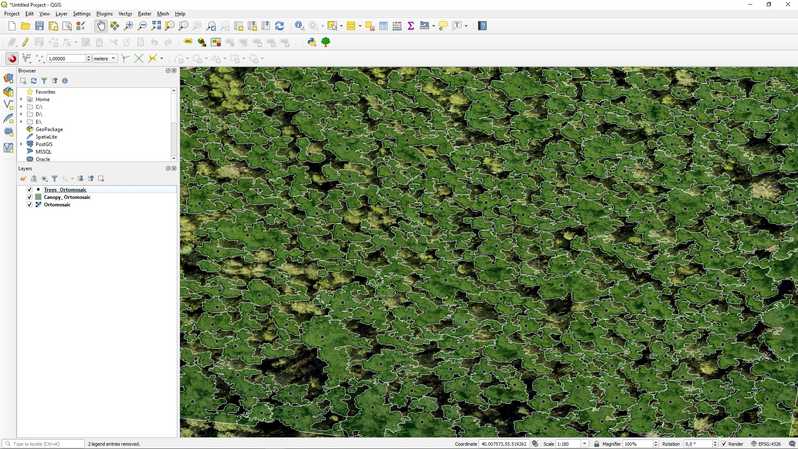

Geoscan Forest
##############

Plugin allows to search for tree tops and perform  tree crowns  segmentation on orthomosaic.
The approximate spatial resolution of input orthomosaic should be about 5 centimeters per pixel.

Send any feedback via support@geoscan.aero or using `Geoscan forum`_ .

    .. _Geoscan forum: https://www.geoscan.aero/forum/viewforum.php?f=85

Instalation:
++++++++++++

- Lunch QGIS 3.x with Admin privileges
- Select **Manage and install plugins..** command from the **Plugins** menu
- Search for **Geoscan Forest** plugin
- Install **Geoscan Forest** pluging 
- Approve dependencies installation 

Getting started:
++++++++++++++++

- Add a raster layer with an orthomosaic to the QGIS project (Layer -> Add Raster Layer)
- Open the plugin window and select the path to the directory where to save the results in GeoJSON format.
- Click  **Compute** button.
  
Options:
++++++++

- Window size - you may set the size of the tile that is processed in one iteration of the work (too large tiles require a large amount of RAM)
- Crone segmentation - you may enable or disable crone segmentation depending on your needs
- Search area - you may perform tree search for whole orthomosaic or for given region - polygon
  

Dependencies:
+++++++++++++

- skimage
- scipy
- geojson
- shapely

In case you install plugin via QGIS Plugin Installer, all dependencies will be installed automatically.

Manual dependencies instalation:
++++++++++++++++++++++++++++++++

- Lunch OSGeo4W Shell console with Aministator privileges
- Make sure that default version of python is 3.x, if not use **py3_env** command
- Install dependencies:
  
.. code-block:: python

	python -m install scikit-image
	python -m install geojson

	[python -m install scipy]
	[python -m install shapely]

License:
++++++++

The plugin is licensed under  GNU GENERAL PUBLIC LICENSE Version 2